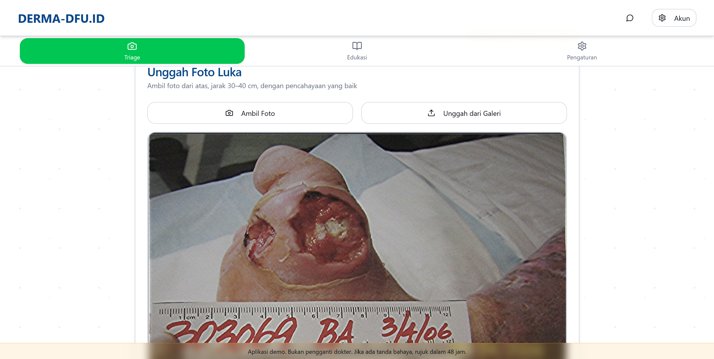
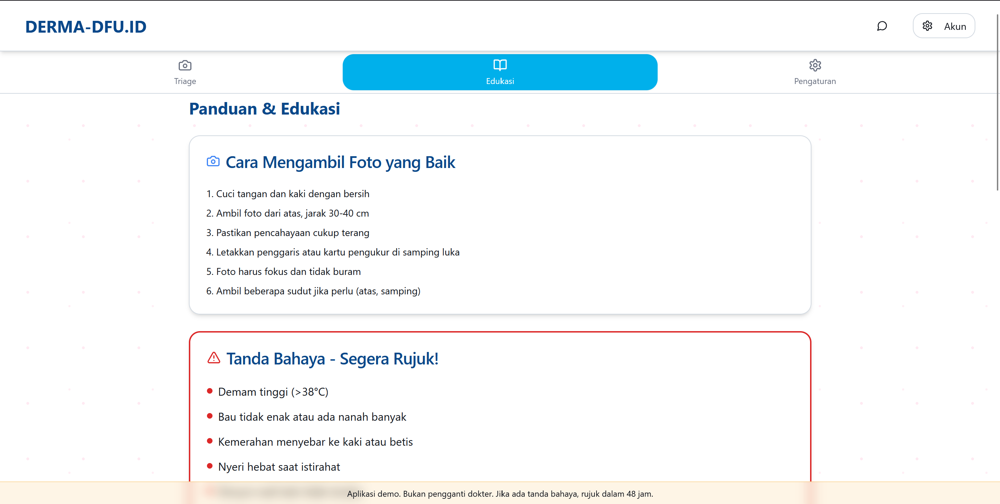
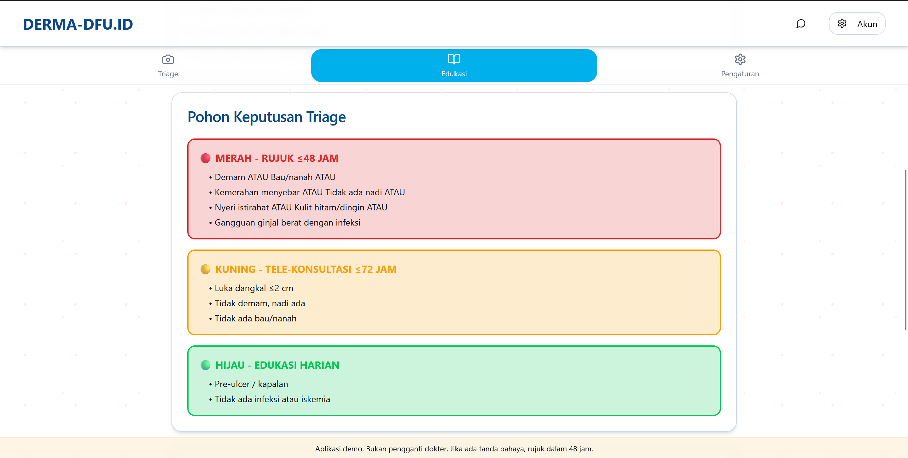
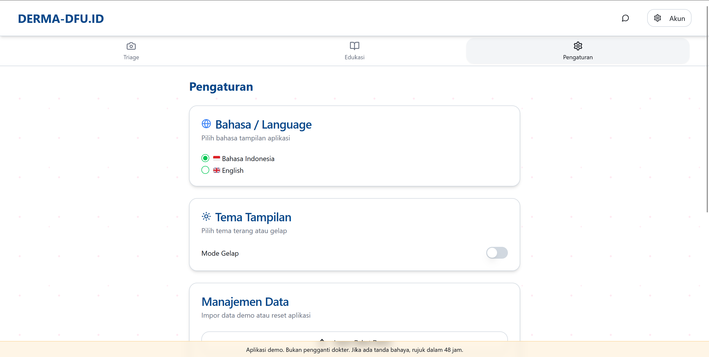
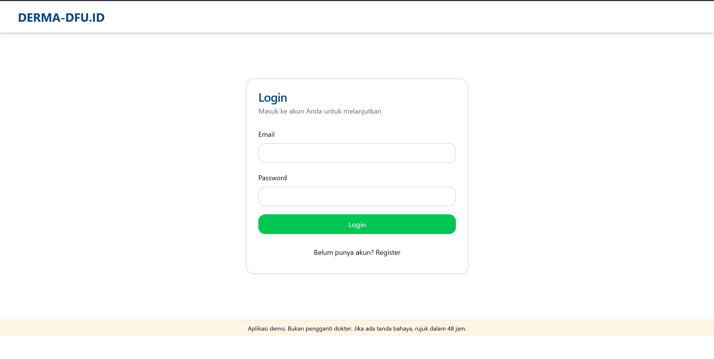
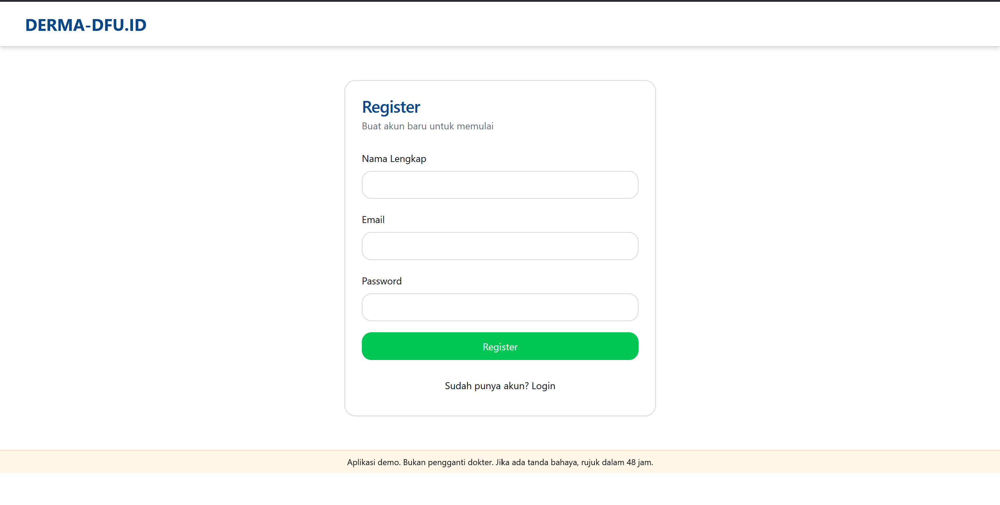
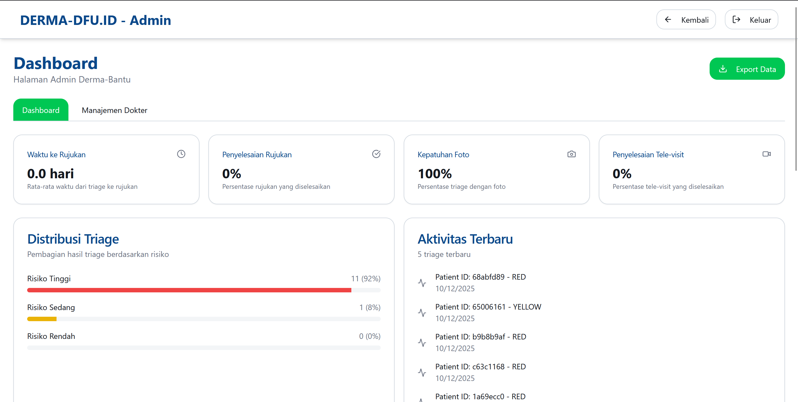
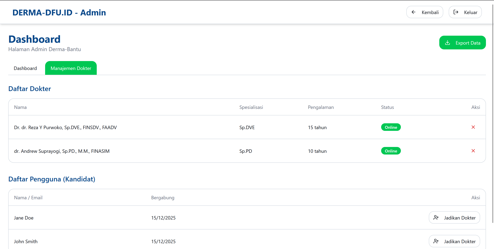
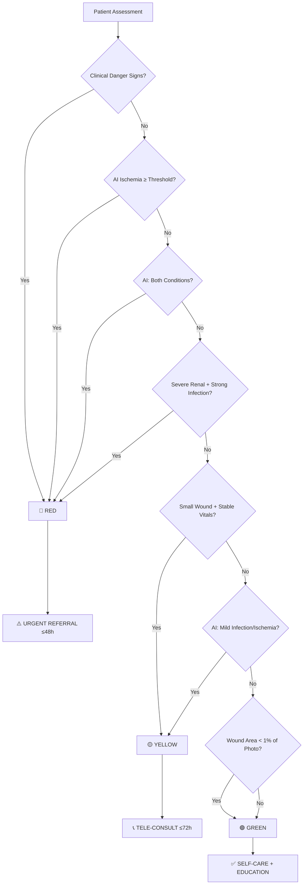

# DERMA-DFU.ID 🏥

<div align="center">
  
  <br />
  
</div>

<div align="center">


[](https://derma-dfu.id)
[](./docs/)

</div>

---

## 🚀 About The Project

**DERMA-DFU.ID** is a comprehensive AI-powered web application designed to revolutionize diabetic foot ulcer (DFU) management in resource-constrained healthcare settings. It provides intelligent, evidence-based triage capabilities for frontline healthcare workers, rural clinics, and diabetes patients.

### 🎯 Core Mission

Democratize access to advanced wound assessment technology by bringing **state-of-the-art deep learning models** directly to healthcare workers and patients through a **privacy-first, browser-based platform** that requires zero external infrastructure.

### 👥 Target Users

| User Type | Primary Use Case |
|-----------|-----------------|
| **Rural Nurses** | Initial screening and triage of diabetic foot patients |
| **General Practitioners** | Evidence-based referral decisions |
| **Diabetes Patients** | Self-monitoring with medical supervision |
| **Clinical Administrators** | Performance monitoring and quality assurance |

### 🌟 Clinical Value Proposition

- ✅ **Early Detection**: AI-powered identification of infection and ischemia at critical stages
- ✅ **Standardized Triage**: RED-YELLOW-GREEN system based on international guidelines (IWGDF, IDSA)
- ✅ **Objective Measurement**: Automated wound area calculation with calibrated metric conversion
- ✅ **Decision Support**: Evidence-based recommendations integrated with clinical danger signs
- ✅ **Digital Documentation**: Complete audit trail for longitudinal patient monitoring

---

## 📸 Screenshots

<div align="center">
  <p><strong>🏠 Main Application Interface</strong></p>
  
  <br/><br/>
  
  <p float="left">
    
    
     
  </p>
  
  <p float="left">
    
    
  </p>
  
  <p float="left">
    
    
  </p>
</div>

---

## 💡 Key Features

### 🤖 AI-Powered Clinical Intelligence

#### **Dual-Model Architecture**
```
┌─────────────────────────────────────────────────────────┐
│           CLIENT-SIDE AI INFERENCE (WASM)               │
├─────────────────────────────────────────────────────────┤
│                                                         │
│  ┌──────────────────┐         ┌──────────────────┐    │
│  │  4-Class CNN     │         │  U-Net Segmenter │    │
│  │  Classifier      │         │  Model           │    │
│  ├──────────────────┤         ├──────────────────┤    │
│  │ Input: 256×256×3 │         │ Input: 512×512×3 │    │
│  │ Model: ~15MB     │         │ Model: ~15MB     │    │
│  │ Output: Softmax  │         │ Output: Prob Mask│    │
│  └────────┬─────────┘         └────────┬─────────┘    │
│           │                            │               │
│           └────────────┬───────────────┘               │
│                        │                               │
│           ┌────────────▼─────────────┐                 │
│           │  Clinical Rule Engine    │                 │
│           │  RED-YELLOW-GREEN Triage │                 │
│           └──────────────────────────┘                 │
│                                                         │
└─────────────────────────────────────────────────────────┘
```

#### **1. Infection & Ischemia Detection (4-Class Classifier)**
- **Architecture**: Custom EfficientNet-based CNN trained on diabetic wound dataset
- **Classes**: `None` | `Infection` | `Ischaemia` | `Both`
- **Output Probabilities**:
  - `P(Infection-present)` = P(Infection) + P(Both)
  - `P(Ischaemia-present)` = P(Ischaemia) + P(Both)
- **Preprocessing**: TensorFlow-style normalization (pixel/127.5 - 1.0)
- **Inference Time**: 2-4 seconds on modern browsers

#### **2. Automated Wound Segmentation (U-Net)**
- **Architecture**: U-Net with ResNet encoder backbone
- **Precision**: Pixel-level wound boundary detection
- **Measurement**:
  - Wound area in pixels (scaled to original image dimensions)
  - Percentage of image covered by wound
  - **Metric conversion** to cm² via interactive calibration
- **Preprocessing**: Normalization to [0,1] range

#### **3. Interactive Calibration System**
<p align="center">
  
</p>

**Two-Point Click Measurement**:
1. User places ruler/scale card next to wound in photo
2. Clicks 2 points on the reference object (e.g., card edges)
3. Inputs known real-world distance (default: 8.56 cm for credit card width)
4. System calculates **mm/pixel scale factor**
5. Wound area automatically converted to **cm²**

**Benefits**:
- ✅ Standardized measurements across different camera distances
- ✅ Supports both metric (cm) and imperial (mm) units
- ✅ Enables longitudinal wound size tracking
- ✅ Clinical documentation with real-world units

---

### 🚦 Evidence-Based Triage System

#### **RED-YELLOW-GREEN Decision Tree**



#### **Triage Categories**

| Priority | Criteria | Action Required | Timeframe |
|----------|----------|----------------|-----------|
| **🔴 RED** (Urgent) | • Fever OR foul odor/pus<br>• Spreading redness<br>• Rest pain OR no foot pulse<br>• Black/cold skin<br>• P(Ischemia) ≥ 62% (calibrated threshold)<br>• AI class = "Both"<br>• Severe kidney disease + strong infection | Immediate referral to specialist/hospital | ≤ 48 hours |
| **🟡 YELLOW** (Observation) | • Small wound (<2cm) + stable vitals<br>• AI class = Infection OR Ischemia (not Both)<br>• Borderline ischemia (58-62%) | Tele-consultation with doctor<br>Daily wound monitoring<br> Sterile dressing changes | ≤ 72 hours |
| **🟢 GREEN** (Self-Care) | • Pre-ulcer / callus stage<br>• Wound area < 1% of photo (gated)<br>• No infection or ischemia detected<br>• Clinically stable | Patient education<br>Daily foot inspection<br>Glucose control<br>Routine clinic follow-up | Ongoing |

---

### 🔒 Privacy-First Architecture

#### **100% Client-Side AI Inference**

<p align="center">
  
</p>

**Zero Data Upload for AI Processing**:
```
┌─────────────────────────────────────────────────────────┐
│                    USER'S BROWSER                        │
│  ┌───────────────────────────────────────────────────┐  │
│  │  1. Photo captured/uploaded (stays in memory)    │  │
│  │  2. ONNX Runtime WASM loads models               │  │
│  │  3. Inference runs locally (3-10 seconds)        │  │
│  │  4. Results generated in-browser                 │  │
│  └───────────────────────────────────────────────────┘  │
│                           │                              │
│                           │ (Optional: User decision)    │
│                           ▼                              │
│  ┌───────────────────────────────────────────────────┐  │
│  │  5. User clicks "Save" → Upload to Supabase      │  │
│  │     - Photo → Storage Bucket (encrypted at rest) │  │
│  │     - Results → PostgreSQL (RLS protected)       │  │
│  └───────────────────────────────────────────────────┘  │
└─────────────────────────────────────────────────────────┘
```

**Key Privacy Features**:
- ✅ **No External AI APIs**: Models run via ONNX Runtime WebAssembly
- ✅ **Offline Capable**: PWA architecture for use without internet (coming soon)
- ✅ **User Control**: Patient explicitly chooses whether to save results
- ✅ **Encrypted Storage**: Supabase automatically encrypts data at rest
- ✅ **Row-Level Security**: Users can only access their own medical records
- ✅ **HIPAA-Ready**: Architecture compliant with privacy regulations

---

### 📊 Advanced Analytics Dashboard

<p align="center">
  
</p>

#### **Performance Indicators (KPIs)**

**For Healthcare Administrators**:
1. **Time to Referral** (hours)
   - Average time from triage to scheduled specialist appointment
   - Target: ≤ 48h for RED, ≤ 72h for YELLOW

2. **Referral Completion Rate** (%)
   - Percentage of recommended referrals actually completed
   - Quality metric for care pathway adherence

3. **Photo Documentation Adherence** (%)
   - Percentage of triage cases with attached wound photos
   - Best practice indicator

4. **Tele-visit Completion** (%)
   - Remote consultation completion rate
   - Telemedicine program effectiveness

#### **Triage Distribution Analytics**
- **30-Day Trend Visualization**: Bar/line charts showing case volume by severity
- **Case Mix Analysis**: Pie chart of RED/YELLOW/GREEN proportions
- **Geographic Heatmap** (roadmap): Identify high-risk communities

#### **Recent Activity Feed**
- Real-time timeline of latest triage assessments
- Quick-view patient location and danger sign flags
- One-click drill-down to full case details

---

### 🏥 Integrated Referral System

#### **Multi-Modal Care Pathways**

<p align="center">
  
</p>

**Consultation Types**:
1. **In-Person Referral**
   - Facility selection from pre-configured network
   - Appointment scheduling with date/time
   - Automated SMS/email reminders (roadmap)

2. **Tele-consultation** (Video)
   - Real-time chat interface with assigned doctor
   - Photo sharing within chat thread
   - Digital prescription capability (roadmap)

3. **Phone Consultation**
   - Scheduled callback system
   - Case summary auto-sent to provider

**Doctor Dashboard** (Role-Based Access):
- Queue of pending referrals
- Patient history and AI assessment results
- Video call integration (WebRTC roadmap)

---

### 📚 Patient Education Module

#### **Interactive Learning Materials**

**Content Categories**:
1. **📸 How to Take Quality Photos**
   - Step-by-step photo guide with lighting tips
   - Do's and Don'ts visual examples
   - Calibration card usage tutorial

2. **⚠️ Danger Signs Recognition**
   - Illustrated guide to fever, pus, spreading redness
   - When to seek emergency care immediately
   - Red flag symptom checklist

3. **🩹 Daily Wound Care**
   - Cleaning and dressing change procedures
   - Proper footwear selection
   - Foot inspection routine

4. **🍎 Diabetes Management**
   - Blood glucose control importance
   - Nutrition basics for healing
   - Exercise safety guidelines

5. **🔗 Trusted Resources**
   - IWGDF Guidelines
   - IDSA Clinical Practice Guidelines
   - Local support groups and hotlines

---

### 🌐 Bilingual Interface (i18n)

**Languages Supported**:
- 🇮🇩 **Bahasa Indonesia** (Primary)
- 🇬🇧 **English** (Secondary)

**Context-Aware Translation**:
- Medical terminology localized for lay understanding
- Clinical terms preserved for healthcare professionals
- Dynamic language switching without page reload

---

## 🛠️ Tech Stack

### 💻 Frontend (Core)

| Technology | Version | Purpose |
|------------|---------|---------|
| **React** | 18.3.1 | UI framework with hooks-based architecture |
| **TypeScript** | 5.8.3 | Type safety and developer experience |
| **Vite** | 5.4.19 | Lightning-fast build tool and HMR |
| **TailwindCSS** | 3.4.17 | Utility-first styling with custom DFU theme |
| **shadcn/ui** | Latest | Accessible, customizable component library |
| **Radix UI** | Latest | Unstyled primitives for accessibility |

### 🔌 State & Data Management

| Technology | Version | Purpose |
|------------|---------|---------|
| **TanStack Query** | 5.83.0 | Server state management, caching, and synchronization |
| **React Router DOM** | 6.30.1 | Client-side routing with lazy loading |
| **React Hook Form** | 7.61.1 | Performant form validation |
| **Zod** | 3.25.76 | Runtime type validation |

### 🔐 Backend & Database

| Technology | Version | Purpose |
|------------|---------|---------|
| **Supabase** | Latest | Backend-as-a-Service (Auth, DB, Storage, Realtime) |
| **PostgreSQL** | 15+ | Relational database with PostGIS extensions |
| **Row-Level Security** | Native | Multi-tenant data isolation |
| **Supabase Storage** | Latest | Encrypted blob storage for wound photos |

### 🤖 AI/ML Infrastructure

| Technology | Version | Purpose |
|------------|---------|---------|
| **ONNX Runtime Web** | 1.23.0 | WebAssembly-based browser inference engine |
| **TensorFlow** | 2.x | Model training (offline, not deployed) |
| **Custom U-Net** | - | Wound segmentation architecture |
| **Custom EfficientNet** | - | 4-class infection/ischemia classifier |

### 🎨 UI/UX Enhancements

| Technology | Version | Purpose |
|------------|---------|---------|
| **Lucide React** | 0.462.0 | Icon system |
| **Recharts** | 2.15.4 | Data visualization for dashboard |
| **Sonner** | 1.7.4 | Toast notification system |
| **Framer Motion** | - (Roadmap) | Animation library for smooth transitions |

---

## ⚙️ Installation & Setup

### Prerequisites

```bash
# Required
Node.js >= 18.0.0
npm >= 9.0.0 (or bun >= 1.0.0)

# Recommended
Git
VS Code with TypeScript and ESLint extensions
```

### 1️⃣ Clone the Repository

```bash
git clone https://github.com/rezayuridian-cell/derma-bantu-sehat.git
cd derma-bantu-sehat
```

### 2️⃣ Install Dependencies

```bash
# Using npm
npm install

# Using bun (faster alternative)
bun install
```

### 3️⃣ Configure Environment

The project uses **Lovable Cloud** integration, so `.env` is auto-generated. For local Supabase development:

```bash
# Copy example environment file
cp .env.example .env
```

**Environment Variables**:
```env
# Auto-managed by Lovable Cloud (DO NOT EDIT MANUALLY)
VITE_SUPABASE_URL=https://tmipvpwehelyguywyvrt.supabase.co
VITE_SUPABASE_PUBLISHABLE_KEY=eyJhbGciOiJIUzI1NiIsInR5cCI6IkpXVCJ9...
VITE_SUPABASE_PROJECT_ID=tmipvpwehelyguywyvrt
```

### 4️⃣ Verify AI Models

Ensure ONNX model files exist in `/public/models/`:

```bash
ls -lh public/models/
# Expected output:
# -rw-r--r-- dfu_4class.onnx       (~15 MB)
# -rw-r--r-- unet_wound.onnx       (~15 MB)
# -rw-r--r-- calibration.json      (<1 KB)
```

**Download Models** (if missing):
```bash
# Contact project maintainers for model files
# Models are proprietary and not included in Git repository
```

### 5️⃣ Run Development Server

```bash
npm run dev
# 💻 App runs at http://localhost:5173
```

**Hot Module Replacement (HMR)** is enabled for instant feedback during development.

---

## 📂 Project Structure

```text
derma-bantu-sehat/
├── .github/                      # GitHub templates & CI/CD workflows
├── public/
│   ├── models/
│   │   ├── dfu_4class.onnx       # 4-class infection/ischemia classifier (~15MB)
│   │   ├── unet_wound.onnx       # U-Net wound segmentation model (~15MB)
│   │   └── calibration.json      # AI threshold parameters (<1KB)
│   ├── logo/
│   │   └── LOGO DERMA-DFU.ID.png # Application logo
│   ├── manifest.json             # PWA manifest
│   └── robots.txt                # SEO configuration
│
├── src/
│   ├── components/
│   │   ├── ui/                   # shadcn/ui components (Button, Card, Input, etc.)
│   │   ├── AdminDoctors.tsx      # Doctor management for admin panel
│   │   ├── CameraCapture.tsx     # Browser camera integration
│   │   ├── Layout.tsx            # App shell with navigation
│   │   └── ReferralModal.tsx     # Referral booking dialog
│   │
│   ├── contexts/
│   │   └── LanguageContext.tsx   # i18n provider (ID/EN switching)
│   │
│   ├── features/
│   │   └── triage/
│   │       └── DFUAnalyzer.tsx   # Standalone wound analysis component
│   │
│   ├── hooks/
│   │   ├── use-mobile.tsx        # Responsive breakpoint detection
│   │   └── use-toast.ts          # Toast notification hook
│   │
│   ├── integrations/
│   │   └── supabase/
│   │       ├── client.ts         # Supabase client instance
│   │       └── types.ts          # Auto-generated database types
│   │
│   ├── lib/
│   │   ├── dfu-onnx.ts           # ⭐ Core AI inference engine (447 lines)
│   │   │                         #   - loadDFUModels(), inferDFU()
│   │   │                         #   - runClassifier(), runSegmenter()
│   │   │                         #   - Calibration, gating, preprocessing
│   │   └── utils.ts              # Helper functions (cn, date formatters)
│   │
│   ├── pages/
│   │   ├── Index.tsx             # Landing page (tab navigation)
│   │   ├── Auth.tsx              # Login/Register with Supabase Auth
│   │   ├── Triage.tsx            # ⭐ Main triage workflow (970 lines)
│   │   │                         #   - Photo upload, calibration UI
│   │   │                         #   - Clinical form, RED-YELLOW-GREEN logic
│   │   │                         #   - Database save, referral modal trigger
│   │   ├── Dashboard.tsx         # Analytics & KPIs (365 lines)
│   │   ├── History.tsx           # Patient triage history table
│   │   ├── Education.tsx         # Educational content sections
│   │   ├── Settings.tsx          # User profile & preferences
│   │   ├── Chat.tsx              # Tele-consultation messaging (263 lines)
│   │   ├── DoctorDashboard.tsx   # Doctor-specific referral queue
│   │   ├── Admin.tsx             # Admin panel (user/doctor management)
│   │   └── NotFound.tsx          # 404 error page
│   │
│   ├── App.tsx                   # Root component with routing
│   ├── main.tsx                  # Entry point (React.render)
│   └── index.css                 # Global styles + Tailwind directives
│
├── supabase/
│   ├── config.toml               # Supabase local dev configuration
│   └── migrations/               # Database schema migrations
│       ├── 20251011174228_*.sql  # Initial schema (profiles, triage_records)
│       ├── 20251013042508_*.sql  # RLS policies
│       ├── 20251210120000_*.sql  # Tele-consultation (doctors, referrals)
│       └── 20251210123000_*.sql  # Admin user management
│
├── docs/
│   ├── DERMA-DFU-System-Documentation.md  # Full technical documentation (951 lines)
│   └── DERMA-DFU-App-Summary_2025-10-13.md # Clinical user guide (710 lines)
│
├── data/
│   ├── Derma-dfu.id 11102025 2200.pptx    # Presentation slides
│   ├── Mebo - Inovasi Tatalaksana (...).pptx # Clinical workshop materials
│   └── Proposal DERMA-DFU.ID 18092025.pdf # Original project proposal
│
├── .editorconfig                 # Editor configuration
├── .env                          # Environment variables (auto-generated, do not edit)
├── .gitignore                    # Git ignore rules
├── eslint.config.js              # ESLint configuration
├── tailwind.config.ts            # Tailwind CSS customization
├── tsconfig.json                 # TypeScript compiler options
├── vite.config.ts                # Vite build configuration
├── package.json                  # Dependencies & scripts
└── README.md                     # This file
```

---

## 🧠 AI Model Architecture & Workflow

### Model Training Pipeline (Offline)

```
┌──────────────────────────────────────────────────────────────┐
│                   OFFLINE TRAINING PHASE                      │
├──────────────────────────────────────────────────────────────┤
│                                                              │
│  1. Data Collection                                          │
│     ├── Diabetic wound images (anonymized)                   │
│     ├── Clinical annotations (infection/ischemia labels)     │
│     └── Expert dermatologist validation                      │
│                                                              │
│  2. Preprocessing                                            │
│     ├── Image augmentation (rotation, flip, color jitter)   │
│     ├── Segmentation mask generation                         │
│     └── Train/validation/test split (70/15/15)              │
│                                                              │
│  3. Model Training                                           │
│     ├── Classifier: EfficientNet-B0 fine-tuned              │
│     │   └── Output: 4-class softmax [None, Inf, Isch, Both]│
│     └── Segmenter: U-Net with ResNet34 encoder              │
│         └── Output: Probability mask (512×512)               │
│                                                              │
│  4. ONNX Export                                              │
│     ├── TensorFlow SavedModel → ONNX conversion             │
│     ├── Quantization (FP32 → FP16, optional)                │
│     └── Validation: Random input sanity checks               │
│                                                              │
│  5. Threshold Calibration                                    │
│     ├── ROC curve analysis on validation set                │
│     ├── Optimize for sensitivity (minimize false negatives) │
│     └── Generate calibration.json parameters                │
│                                                              │
└──────────────────────────────────────────────────────────────┘
```

### Inference Workflow (Client-Side)

```typescript
// Simplified inference pseudocode from src/lib/dfu-onnx.ts

async function inferDFU(imageUrl: string, opts?: { mmPerPx?: number }) {
  // 1. Load models & calibration
  await loadDFUModels(); // Loads both ONNX models + calibration.json
  
  // 2. Preprocess image
  const imageData = getImageDataFromImageElement(imageUrl);
  
  // 3. Run classifier (4-class)
  const clf = await runClassifier(imageData);
  // → Output: { topIdx, probs4, pInfPresent, pIscPresent, ... }
  
  // 4. Run segmenter (U-Net)
  const seg = await runSegmenter(imageData);
  // → Output: { areaPx, areaFrac, ... }
  
  // 5. Apply gating logic
  if (seg.areaFrac < 0.01) {
    gated = true;
    clf.topIdx = 0; // Force to "None"
    clf.probs4 = [1, 0, 0, 0];
  }
  
  // 6. Calculate wound area in cm² (if calibrated)
  let areaCm2 = null;
  if (opts.mmPerPx > 0) {
    areaCm2 = (seg.areaPx * opts.mmPerPx² / 100.0);
  }
  
  // 7. Return structured output
  return {
    infection: { topIdx, probs, pPresent: pInfPresent, ... },
    ischaemia: { prob: pIscPresent, threshold: 0.62, gated },
    seg: { areaPx, areaFrac, areaCm2 },
    calibration: { thresholds, labels },
    model: { sha256, preprocessing: "EFFICIENTNET_TF" }
  };
}
```

**Key Implementation Details**:
- **WASM CDN Loading**: ONNX Runtime WASM files loaded from jsDelivr CDN to bypass COOP/COEP headers
- **Single-Threaded Execution**: `ort.env.wasm.numThreads = 1` for compatibility
- **SHA256 Verification**: Model integrity check via hash comparison
- **Queue-Based Inference**: Prevents concurrent WASM session conflicts
- **Gating Mechanism**: Ignores classifier output for wounds <1% of photo area

---

## 🔐 Security & Privacy

### Row-Level Security (RLS) Policies

**Database-Level Access Control**:

```sql
-- Users can only view their own triage records
CREATE POLICY "Users view own triages"
ON triage_records FOR SELECT
USING (auth.uid() = user_id OR has_role(auth.uid(), 'admin'));

-- Users can only insert triages with their own user_id
CREATE POLICY "Users insert own triages"
ON triage_records FOR INSERT
WITH CHECK (auth.uid() = user_id);

-- Admins can view all records for analytics
CREATE POLICY "Admins view all triages"
ON triage_records FOR SELECT
USING (has_role(auth.uid(), 'admin'));
```

**Helper Function**:
```sql
CREATE FUNCTION has_role(_user_id uuid, _role app_role)
RETURNS boolean AS $$
  SELECT EXISTS (
    SELECT 1 FROM user_roles
    WHERE user_id = _user_id AND role = _role
  )
$$ LANGUAGE sql STABLE SECURITY DEFINER;
```

### Authentication Flow

```
User Registration → Supabase Auth (JWT) → Auto-create Profile → Assign 'user' Role
                                                ↓
                                        Session Stored (localStorage)
                                                ↓
                                    All API Calls Include JWT Header
                                                ↓
                                        RLS Policies Enforce Access
```

### Data Encryption

| Layer | Encryption Method | Key Management |
|-------|------------------|----------------|
| **In-Transit** | TLS 1.3 | Supabase-managed certificates |
| **At-Rest** | AES-256 | AWS KMS (Supabase backend) |
| **Client-Side** | Browser IndexedDB (optional) | User device secure enclave |

### Compliance Readiness

- ✅ **HIPAA**: Technical safeguards in place (encryption, access logs, audit trail)
- ✅ **GDPR**: Right to erasure, data portability, consent mechanisms
- ✅ **Indonesian MoH Standards**: Aligned with Permenkes regulations for digital health

---

## 🚨 Important Medical Disclaimers

### ⚠️ Clinical Use Limitations

> **THIS APPLICATION IS A SCREENING TOOL, NOT A DIAGNOSTIC DEVICE.**
> 
> DERMA-DFU.ID provides decision support based on AI-driven risk assessment. It is NOT a replacement for:
> - Professional medical diagnosis by licensed physicians
> - Physical examination and clinical judgment
> - Laboratory tests (blood cultures, imaging, etc.)
> - Direct patient-doctor consultation
> 
> **Final clinical decisions must ALWAYS be made by qualified healthcare professionals.**

### Model Accuracy & Uncertainty

**Known Limitations**:
1. **Photo Quality Dependency**: Poor lighting, blur, or occlusion degrades AI accuracy
2. **Dataset Bias**: Model trained primarily on Asian skin tones (validation ongoing for other populations)
3. **Threshold Sensitivity**: Default thresholds (62% ischemia, 57% infection) may require local calibration
4. **Gating Mechanism**: Wounds < 1% of photo area are auto-classified as "None" to avoid false positives
5. **Rare Presentations**: Atypical wound morphologies may not be recognized

**Recommended Best Practices**:
- ✅ Use consistent lighting and camera distance across assessments
- ✅ Validate AI results against clinical examination
- ✅ Recalibrate thresholds quarterly based on local outcome data
- ✅ Escalate all RED cases regardless of AI confidence level
- ✅ Document discrepancies between AI and clinical judgment

### Referral Obligations

**Mandatory Actions**:
- 🔴 **RED** cases: Specialist referral within 48 hours (legal/ethical obligation)
- 🟡 **YELLOW** cases: Medical consultation within 72 hours
- 🟢 **GREEN** cases: Routine monitoring (not "no care needed")

**Emergency Criteria** (bypass app, call ambulance):
- Altered mental status
- Signs of sepsis (fever >38.5°C + hypotension)
- Rapidly spreading cellulitis (>2cm/hour)
- Gas gangrene (crepitus)

---

## 🗺️ Roadmap & Future Enhancements

### 🚀 Phase 1: Core Stabilization (Q1 2026)

- [x] 4-class AI model deployment
- [x] Web-based triage workflow
- [x] Supabase backend integration
- [x] Basic analytics dashboard
- [ ] **PWA Offline Mode**: Cache models and allow offline triage
- [ ] **Mobile Responsiveness Optimization**: Enhanced touch targets and mobile UX
- [ ] **Automated Testing Suite**: Cypress E2E tests for critical workflows

### 🔬 Phase 2: Clinical Validation (Q2 2026)

- [ ] **Multi-Center Prospective Study**: Validate AI accuracy across 5 hospitals (n=500 patients)
- [ ] **Threshold Recalibration**: Update `calibration.json` based on Indonesian population data
- [ ] **Sensitivity Analysis**: Publish performance metrics stratified by wound location and diabetes type
- [ ] **Regulatory Approval**: Submit to Indonesian FDA (BPOM) as Class IIa Medical Device Software

### 🌍 Phase 3: Feature Expansion (Q3-Q4 2026)

#### **AI Enhancements**
- [ ] **Model Quantization**: Reduce ONNX models to <5MB each (INT8 quantization)
- [ ] **Multi-Wound Detection**: Support cases with multiple ulcers in single photo
- [ ] **Temporal Tracking**: AI-powered wound healing rate analysis (compare serial photos)
- [ ] **Explainable AI**: Grad-CAM heatmaps showing which image regions influenced prediction

#### **Telemedicine Integration**
- [ ] **WebRTC Video Calls**: Direct doctor-patient video consultation within app
- [ ] **Digital Prescriptions**: e-Prescription generation and e-pharmacy integration
- [ ] **SMS Reminders**: Automated appointment and medication reminders via Twilio

#### **Advanced Analytics**
- [ ] **Predictive Analytics**: ML model to forecast amputation risk based on longitudinal data
- [ ] **Geographic Heatmaps**: Identify diabetes hotspots for public health interventions
- [ ] **Cost-Effectiveness Dashboard**: Calculate healthcare cost savings from early detection

#### **Interoperability**
- [ ] **FHIR API**: HL7 FHIR-compliant API for EMR integration
- [ ] **DICOM Export**: Package wound photos as DICOM files for PACS systems
- [ ] **BI Tools Integration**: Power BI / Tableau connectors for hospital reporting

### 🌐 Phase 4: Global Expansion (2027+)

- [ ] **Multi-Language Support**: Spanish, Portuguese, Hindi, Arabic translations
- [ ] **iOS/Android Native Apps**: React Native rewrite for app store distribution
- [ ] **API Marketplace**: White-label API for third-party health platforms
- [ ] **AI Model Marketplace**: Allow institutions to upload custom-trained models
- [ ] **Research Consortium**: Open dataset initiative for academic collaboration

---

## 📖 Documentation

### For Developers
- 📘 **[Full System Documentation](./docs/DERMA-DFU-System-Documentation.md)** (951 lines)
  - Architecture deep dive
  - Database schema and migrations
  - API reference
  - Deployment guide

- 📕 **[AI Model Technical Spec](./docs/DERMA-DFU-App-Summary_2025-10-13.md)** (710 lines)
  - Model training methodology
  - Inference pipeline details
  - Calibration procedures
  - Clinical validation protocols

### For Clinicians
- 📗 **[Clinical User Guide](./docs/clinical-guide.md)** (Coming Soon)
  - Step-by-step triage workflow
  - Interpreting AI results
  - Case studies and examples
  - FAQ for healthcare providers

### For Administrators
- 📙 **[Deployment & Ops Manual](./docs/deployment-guide.md)** (Coming Soon)
  - Infrastructure setup
  - Monitoring and alerting
  - Backup and disaster recovery
  - Compliance checklists

---

## 🤝 Contributing

We welcome contributions from the open-source community! Here's how you can help:

### Development Setup

```bash
# 1. Fork the repository
# 2. Clone your fork
git clone https://github.com/YOUR_USERNAME/derma-bantu-sehat.git

# 3. Create a feature branch
git checkout -b feature/amazing-feature

# 4. Make your changes and commit
git commit -m "feat: add amazing feature"

# 5. Push to your fork
git push origin feature/amazing-feature

# 6. Open a Pull Request
```

### Contribution Guidelines

**Code Style**:
- Follow existing TypeScript conventions
- Run `npm run lint` before committing
- Add JSDoc comments for public functions
- Write unit tests for new features

**Commit Messages** (Conventional Commits):
- `feat:` New feature
- `fix:` Bug fix
- `docs:` Documentation changes
- `refactor:` Code refactoring
- `test:` Adding tests
- `chore:` Maintenance tasks

**Pull Request Checklist**:
- [ ] Code passes ESLint checks
- [ ] All tests pass (`npm run test`)
- [ ] Documentation updated (if applicable)
- [ ] CHANGELOG.md updated
- [ ] Screenshots added for UI changes

---

## 📧 Support & Contact

### Need Help?

- 📚 **Documentation**: [docs.derma-dfu.id](https://docs.derma-dfu.id) (Coming Soon)
- 💬 **Community Forum**: [GitHub Discussions](https://github.com/rezayuridian-cell/derma-bantu-sehat/discussions)
- 🐛 **Bug Reports**: [GitHub Issues](https://github.com/rezayuridian-cell/derma-bantu-sehat/issues)
- 📧 **Email**: support@derma-dfu.id

### Project Team

#### 🏥 Clinical Leadership
- **Dr. dr. Reza Yuridian Purwoko, Sp.DVE., FINSDV., FAADV** - *Principal Investigator & Clinical Lead*
  - Dermatology & Venereology Specialist
  - PI Kliinis/Sp. Kulit - BRIN, Metaderma
  - Universitas Airlangga / RSUD Dr. Soetomo

#### 👨‍⚕️ Medical Consultants Team
- **dr. Andrew Suprayogi, Sp.PD** - *Internal Medicine Specialist*
  - Diabetes management consultant
  - Clinical protocol advisor

- **dr. Agus Ujianto, M.Si. Med, Sp.B** - *General Surgery Specialist*
  - Wound care surgical consultant
  - Advanced DFU management

- **dr. Tzeto Han Cong, Sp.PK** - *Clinical Pathology Specialist*
  - Laboratory diagnostics consultant
  - Infection biomarker analysis

- **Dr. Indra W Putra, SpS MCS FIMACS** - *Neurology Specialist*
  - Diabetic neuropathy consultant
  - Neurological complication assessment

#### 💻 AI & Engineering Team
- **Asmaill** - *AI Engineer*
  - Deep learning model development
  - ONNX model optimization
  - Classifier & segmentation architecture
  
- **Ferri Krisdiantoro** - *AI Engineer*
  - Machine learning pipeline
  - Model training & validation
  - Inference engine development
  
- **Silvan Saputra, S. Biotech** - *Co-Lead Research (Regenerative/ATMP)*
  - Biomedical research integration
  - Advanced therapy medicinal products
  - Clinical validation protocols

> **Complete Team**: For full team details including contributors, advisors, and supporting staff, please refer to project presentation materials.


### Research Collaboration

For academic partnerships, clinical validation studies, or dataset access requests:
- 🔬 **Research Inquiries**: research@derma-dfu.id
- 📄 **Publications**: [Link to Papers](-)

---

## 📜 License

This project is licensed under the **MIT License** - see the [LICENSE](LICENSE) file for details.

However, please note:
- **AI Models**: Proprietary (contact for licensing)
- **Clinical Guidelines**: Adapted from IWGDF/IDSA (CC BY-NC-SA 4.0)
- **Patient Data**: MUST comply with local healthcare privacy laws

---

## 🙏 Acknowledgments

### 🏥 Clinical Partners

**Academic Institutions**:
- **Universitas Airlangga** - Faculty of Medicine
  - Research collaboration and clinical validation
  - Medical student training program
  
- **RSUD Dr. Soetomo** - Dermatology & Venereology Department
  - Clinical data provision
  - Patient recruitment for validation studies
  - Specialist consultation network

- **BRIN (Badan Riset dan Inovasi Nasional)** - National Research and Innovation Agency
  - Advanced wound healing research
  - Regenerative medicine initiatives
  - Scientific collaboration and validation

**Professional Organizations**:
- **Indonesian Diabetic Foot Study Group (IDFSG)**
  - Clinical guideline adaptation
  - Multi-center validation support
  
- **PERDOSKI (Indonesian Dermatology & Venereology Association)**
  - Clinical protocol review
  - Continuing medical education platform

### 🤝 Strategic Healthcare Partners

**Digital Health Platforms**:
- **Metaderma** - Primary Technology Platform Partner
  - Powered by Dr. Sonia Wibisono (Co-founder drSlimming.id)
  - Telemedicine infrastructure integration
  - Dermatology consultation network
  - WhatsApp-based consultation system

- **drSlimming.id** - Wellness & Medical Technology Collaboration
  - **PT. Nutrisolusi Medika Teknologi**
  - Founded by:
    - **dr. Sonia Wibisono** (Co-founder)
    - **dr. Marya W Haryono MGizi, SpGK, FINEM** (Co-founder/CMO)
    - **Shireen Sungkar** (Co-founder/Celebrity Entrepreneur)
  - Diabetes & nutrition management integration
  - Patient wellness program collaboration
  - Health technology innovation partnership

**Technology Enablers**:
- **Lovable Cloud** - Managed Supabase hosting and deployment infrastructure
- **ONNX Runtime Team** - WebAssembly inference optimization support
- **React & TypeScript Community** - Open-source framework support

**UI/UX Frameworks**:
- **shadcn** - Open-source accessible component library
- **Tailwind Labs** - Modern CSS framework
- **Radix UI** - Unstyled accessible primitives

### 💰 Funding & Grants

**Government Support**:
- **Kementerian Kesehatan Republik Indonesia (PSEF Program)** - Digital Health Innovation Grant
  - Primary funding source for platform development
  - Public-private partnership initiative
  - Healthcare technology acceleration program

- **BRIN (Badan Riset dan Inovasi Nasional)** - Research Collaboration Grant
  - Advanced therapy medicinal products (ATMP) research
  - Regenerative medicine for diabetic wounds
  - Clinical validation support

- **Ministry of Research & Technology** - Applied Research Funding
- **BPJS Kesehatan** - Universal Health Coverage Pilot Program (Planned)

**International Organizations**:
- **World Health Organization (WHO)** - Universal Health Coverage Fund (Planned)
- **Asian Development Bank** - Digital Healthcare Infrastructure Grant (Under Review)

**Private Sector Support**:
- **PT. Nutrisolusi Medika Teknologi (drSlimming.id)** - Strategic Partnership
  - Medical technology development collaboration
  - Healthcare innovation co-funding

### 🌟 Special Thanks

**Data Contributors**:
- All participating patients who generously contributed wound images and clinical data for AI model training
- Healthcare workers at partner clinics who provided expert annotations and validation

**Research Support**:
- Medical interns and residents who assisted with data collection
- Clinical photographers for high-quality wound documentation
- Laboratory staff for supporting diagnostic validation

**Community**:
- Open-source community for foundational libraries (React, TypeScript, ONNX, Supabase)
- GitHub contributors who reported bugs and suggested features
- Beta testers from rural clinics who provided invaluable real-world feedback

**Advisors & Mentors**:
- Expert panel of dermatologists and diabetologists for clinical guidance
- AI ethics board for responsible AI deployment review
- Regulatory consultants for medical device compliance

> **Partnership Opportunities**: For collaboration inquiries, please contact partnerships@derma-dfu.id
>
> **Detailed Partnership Information**: Comprehensive collaboration details are available in project presentation materials (`data/Mebo - Inovasi Tatalaksana Ulkus Kaki Diabetik 01122025 14.31.pptx`)


---

<div align="center">

**⚕️ Democratizing Access to Advanced Wound Care Through AI**

Made with ❤️ for Healthcare Workers and Diabetes Patients in Indonesia

[](https://github.com/rezayuridian-cell/derma-bantu-sehat)
[](https://twitter.com/dermadfu)

---

**© 2025 DERMA-DFU Team. All Rights Reserved.**

</div>
